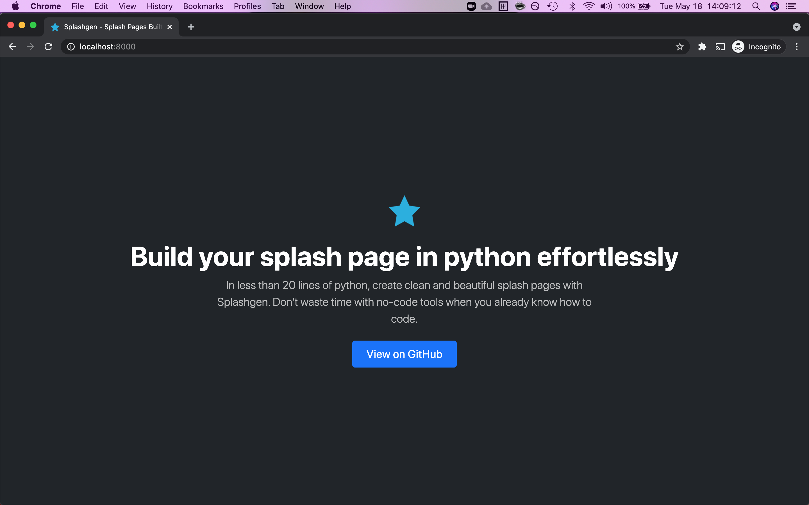

# SplashGen

SplashGen lets you rapidly build simple landing pages as easily as you can build a simple command-line application.

You write this:

```python
# website.py

from splashgen import launch
from splashgen.components import SplashSite, CTAButton

site = SplashSite(title="Splashgen - Splash Pages Built In Python",
                  theme="dark")
site.headline = "Build your splash page in python effortlessly"
site.subtext = """
In less than 20 lines of python, create clean and beautiful splash pages with
Splashgen. Don't waste time with no-code tools when you already know how to
code.
"""
site.call_to_action = CTAButton(
    "https://github.com/true3dco/splashgen", "View on GitHub")

launch(site)
```

Run this:

```sh
splashgen website.py
python -m http.server --directory build
```

And get this:



We built splashgen because we wanted a way to rapidly build landing pages without having to use no-code tools or copy bootstrap
templates all over the place, and want to share it with you!

## Installation

> **NOTE**: You will need Python 3.7+

`pip install splashgen`

## Usage

### Developing your page

To build your splash page, you write a simple python script using the APIs that `splashgen` provides. Here is the simplest possible way to build a splash page:

```python
from splashgen import SplashSite, launch

launch(SplashSite())
```

You use the `SplashSite` class in order to configure properties of your site, such as its headline, its subtext, and its call to action. You can also specify a custom logo (which will be automatically transformed into a favicon), as well as any SEO data you may want for site previews.

`launch` tells splashgen to build the splash site that you've specified.

The easiest way to see what splashgen can do is to look in the `examples/` folder at what's there. You'll find both the [splashgen site](https://splashgen.sh), as well as a splash page for [ZenWeb](https://zenweb.dev), an idea that we had before we started working
on splashgen :smiley:

> **NOTE**: If you include URLs and emails in the subtext, splashgen will automatically linkify them for you.

### Building your site

When you're ready to build, run `splashgen path/to/file.py`. Splashgen will output the built site within a folder called `build/`, which you can then serve using any http server.

If you want to make a change to the site, simply re-run `splashgen paty/to/file.py`. This will regenerate the site.

> **NOTE**: Any previously built files still persist in the build directory. If you want to do a completely clean rebuild, make sure you `rm -fr build/` first before re-running the command.

### Adding a hero image

As seen in `examples/zenweb.py`, you can add a hero image to your page by assigning to the `hero_image` property on a
`SplashSite` instance.

```python
site.hero_image = "/path/to/hero-image.png"
```

### Adding a MailChimp signup form

As seen in `examples/zenweb.py`, you can add a [MailChimp](https://mailchimp.com/) signup form to your splash site by doing the
following.

Get your [signup form url](https://mailchimp.com/help/share-your-signup-form/#Find_share_options) for the form you want to use.
Then, write the following

```python
from splashgen.integrations import MailchimpSignup

site = SplashSite(title="...")
# configure the site

site.call_to_action = MailchimpSignup("<signup form url>", button_text="Join the waitlist")
```

We plan on adding more integrations soon!

### Adding a custom form

You can add a custom form which will POST to an endpoint specified with the given data.
We currently support a limited subset of form fields. If you need more types of inputs, or
extended functionality, please file an issue and let us know!

```python
from splashgen.components import Form, TextInput, EmailInput, SelectInput

inputs = [
    # NOTE: You can omit the label argument to just use inputs with placeholders
    TextInput(id="name", label="Name", required=True,
              placeholder="First and Last"),
    EmailInput(id="email", label="Email address", required=True),
    SelectInput(id="role", label="Role", options=[
        # You can specify a (text, value) tuple, or just provide text, and the
        # value will be a slugified version of the text.
        ("CEO/Founder", "exec"),
        "Engineer",
        "Other"])
]
site.call_to_action = Form(endpoint="http://postman-echo.com/post",
                           inputs=inputs,
                           submit_text="Get Started")
```

For a full-fledged example, see [examples/form_cta.py](./examples/form_cta.py)

### Deploying to GitHub pages

You can easily deploy splashgen sites to github pages, as long as you don't mind checking in your `build/` folder with
your repo.

1. Create a repository which will host your site script.
1. Write your site script, e.g. `website.py`, at the root of your repo
1. Run an initial build, e.g. `splashgen build site.py`
1. `git push` to your repo (NOTE: make sure you _do not put build/ as part of your gitignore_)
1. On your repo's settings tab, navigate to `Pages` on the sidebar, then under `Source`, choose the folder `/build`
1. Click "Save"

Now when you go to `<username>.github.io/<repo>`, you should see your built site.

More info: https://docs.github.com/en/pages/getting-started-with-github-pages/configuring-a-publishing-source-for-your-github-pages-site#choosing-a-publishing-source

Also, check out https://github.com/Dohva/RakdamSplash for an example of how to use GitHub's workflows to
build a splashgen site without having to check in the `build/` directory ([code](https://github.com/Dohva/RakdamSplash/blob/27e8e64c927ea2c8757b84b530fe3c00f143808f/.github/workflows/python-app.yml)).

### Deploying to Netlify

You can deploy splashgen sites to [Netlify](https://www.netlify.com/) without checking in your `build/` folder,
and have Netlify build and deploy the site for you.

1. Create a repository which will host your site script.
1. Write your site script, e.g. `website.py`, at the root of your repo
1. From your repo root, run `echo splashgen > requirements.txt`
1. From your repo root, run `echo 3.7 > runtime.txt`
1. `git push` to your repo
1. In the Netlify console, create a new site from git
1. Add the repo that you just created
1. Put `splashgen website.py` as the build command
1. Put `build` as the publish directory
1. Click the create button, and your site should now be ready to deploy on Netlify

> **NOTE**: Because splashgen is still in early development, you may want to pin the version of splashgen you used to build
> the site. In that case, change `splashgen` in `requirements.txt` to `splashgen==0.0.23`, or whatever the current version
> you have installed is.

You can see an example of a site deployed to Netlify on [splashgen's splash pages's repo](https://github.com/true3dco/splashgen.sh-site)

### Opting out of analytics

By default, splashgen sites contain a simple analytics snippet that helps us determine usage. **We explicitly opt-out of tracking
any personally identifiable information, and only track the site's host name.** As a free and open-source product, it's important
that we're able to measure usage of splashgen in order to continue to invest in its development.

That said, you can easily opt-out of analytics tracking by adding the following code-snippet:

```python
site.enable_splashgen_analytics = False
```

## Help us out! :pray:

Splashgen is currently in an early alpha. If there are any missing features that you would like added please open an issue and we will add it in! This API is in flux and will receive significant improvements and changes over the next few weeks.

## FAQ

### I'm seeing an error that says launch() was never called

This is most likely because you've named your Python file something that conflicts with an existing package. E.g.
if you name your file `site.py`, that conflicts with python's [site module](https://docs.python.org/3/library/site.html).
We're currently working on a way around this, but for now the easiest thing to do would be to change your file name.
